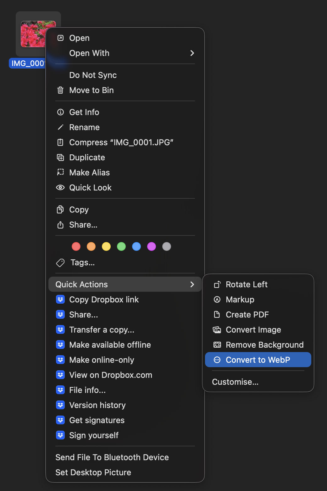

# Convert to WebP — macOS Finder Quick Action

Right-click any image on your Mac and convert it to a web-optimised WebP file in one click.

 

## What it does

- Adds **Convert to WebP** to the right-click Quick Actions menu in Finder
- Works on JPEG, PNG, HEIC, and most other image formats
- Resizes to a **maximum of 1920px** on the longest side (no upscaling)
- Encodes at **quality 80** — typically 25–50% smaller than the original JPEG
- Saves the output as `filename-web.webp` **in the same folder** as the original
- Shows a notification when conversion is complete
- Supports **multiple selected files** at once

## Install

Open Terminal and paste:

```bash
bash <(curl -fsSL https://raw.githubusercontent.com/YOUR_USERNAME/webp-quickaction/main/install-webp-quickaction.sh)
```

Or download `install-webp-quickaction.sh` and run:

```bash
bash ~/Downloads/install-webp-quickaction.sh
```

The script will:
1. Install [Homebrew](https://brew.sh) if you don't have it
2. Install `cwebp` (Google's WebP encoder) via Homebrew
3. Create and register the Quick Action
4. Restart Finder

## Usage

1. Right-click any image file in Finder
2. Hover over **Quick Actions**
3. Click **Convert to WebP**
4. A `filename-web.webp` file appears in the same folder



## Requirements

- macOS Ventura (13) or later
- Apple Silicon or Intel Mac

## Uninstall

```bash
rm -rf ~/Library/Services/"Convert to WebP.workflow"
/System/Library/CoreServices/pbs -flush
```
